Final Project
================
W. Hunter Giles

- <a href="#aim" id="toc-aim">Aim</a>
- <a href="#data-sets" id="toc-data-sets">Data Sets</a>
- <a href="#explore-data" id="toc-explore-data">Explore Data</a>
  - <a href="#spxl" id="toc-spxl">SPXL</a>
  - <a href="#morgan-stanley" id="toc-morgan-stanley">Morgan Stanley</a>
- <a href="#time-series-model" id="toc-time-series-model">Time Series
  Model</a>
  - <a href="#ar1-garch11" id="toc-ar1-garch11">AR(1) + GARCH(1,1)</a>
  - <a href="#residual-fits" id="toc-residual-fits">Residual Fits</a>
  - <a href="#copula-fit" id="toc-copula-fit">Copula Fit</a>
- <a href="#residual-analysis" id="toc-residual-analysis">Residual
  Analysis</a>
  - <a href="#spxl-1" id="toc-spxl-1">SPXL</a>
  - <a href="#morgan-stanley-1" id="toc-morgan-stanley-1">Morgan Stanley</a>
- <a href="#risk-calculation" id="toc-risk-calculation">Risk
  Calculation</a>
- <a href="#appendix" id="toc-appendix">Appendix</a>
  - <a href="#a.-augmented-dicky-fuller"
    id="toc-a.-augmented-dicky-fuller">A. Augmented Dicky Fuller</a>
  - <a href="#b.-ljung-box-test-on-log-returns"
    id="toc-b.-ljung-box-test-on-log-returns">B. Ljung-Box Test on Log
    Returns</a>
  - <a href="#c.-argarch-model-fits" id="toc-c.-argarch-model-fits">C.
    AR+GARCH Model Fits</a>
  - <a href="#d.-ar-and-garch-functions"
    id="toc-d.-ar-and-garch-functions">D. AR and GARCH functions</a>
  - <a href="#e.-bootstrap-confidence-intervals"
    id="toc-e.-bootstrap-confidence-intervals">E. Bootstrap Confidence
    Intervals</a>
  - <a href="#f.-project-code" id="toc-f.-project-code">F. Project Code</a>

## Aim

This project aims to estimate the market risk of a portfolio containing
two different financial stocks. The risk estimand chosen is
Value-at-Risk (VaR) because of its wide use and interpretability. VaR
requires two parameters, a confidence coefficient and a time horizon. We
use a 99% confidence level for the next day’s portfolio log return. This
process is iterated over several portfolio weights to determine the
lowest risk combination. The process to obtain this goal utilizes
advanced econometric techniques.

## Data Sets

Morgan Stanley (MS) and Direxion Daily S&P 500 Bull 3X Shares (SPXL) are
the two stocks that make up the portfolio. Morgan Stanley is an
investment management and financial services company currently the
sixty-fourth largest weighted stock in the S&P 500. The firm supplies
investment banking products globally to individuals, corporations, and
governments. As of 2022, the company has a 150.758 billion market cap
and is projected to bring in more than 60 billion in revenue this year.

The S&P 500 is a market-cap-weighted index of the top 500 large-cap and
mid-cap US companies. SPXL is a tactical leverage product that gets 3x
exposure (this is subject to variation) to the S&P 500. According to
yahoo finance, the fund invests approximately 80% of its assets in
various financial instruments, including swaps, S&P securities, and
ETFs. Ten years ago, the stock was trading at \$6.30 a share, as of
11/15/2022, it is trading at 60.54 a share (1,003% increase), with a
spike in January 2022 at \$145.77 per share.

This analysis uses ten years of daily data between 11/15/2012 to
11/15/2022 for both MS and SPXL. The data is collected from yahoo
finance’s API. The financial engineering that went into the project is
explained step-by-step in the code/text below. The entire code used for
the project, including the graphs, is in the Appendix.

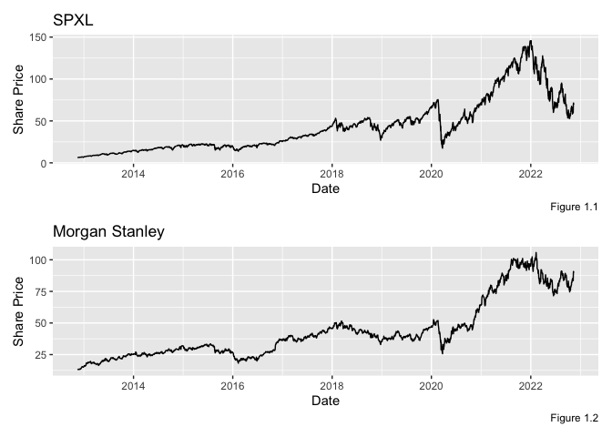

## Explore Data

### SPXL

Given the yahoo finance data, log returns are calculated and analyzed.
Figure 2.3 shows the SPXL returns have a bell-shaped curve with a mean
return of .00098, a standard deviation of .03326, and light tales.
Figure 2.1 displays SPXL log returns over time, and figure 2.2 shows the
same time series volatility. These two graphs indicate the stationary
time series (Augmented Dicky Fuller in Appendix A) has time-varying
volatility. A normal ARIMA process assumes constant condition variance,
so the data suggests we need a GARCH model.

An ACF plot is displayed below. The autocorrelation coefficient
converges to zero, further indicating a stationary trend. However, the
Ljung-Box test results (Appendix B) show a non-zero correlation in the
first ten lags (k=10). From this, we can reject the white noise null
hypothesis and take advantage of the serial correlation in an AR
process.

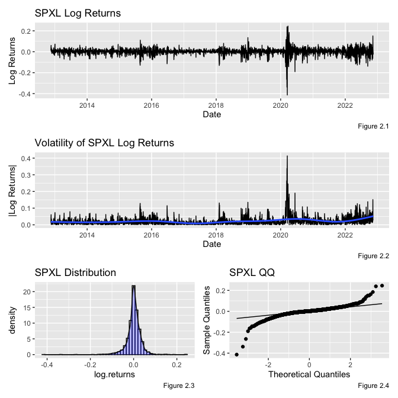

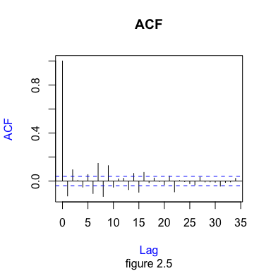

### Morgan Stanley

The Morgan Stanley log returns have a mean of .00077, a standard
deviation of .01965, and light tails. From figure 2.1, the returns
appear to be stationary (ADF Test in Appendix A) with time-varying
volatility (figure 2.2). The Ljung-Box test outputs a p-value less than
.05 (Appendix B), so we can reject the null hypothesis and conclude that
there is a short-term serial correlation (K=10). The ACF chart below is
another indicator that the data converge to stationary.

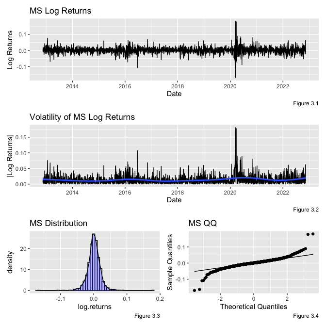

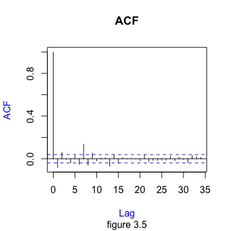

## Time Series Model

### AR(1) + GARCH(1,1)

In the “Explore Data” section, we concluded, with reasonable confidence,
that SPXL and MS stock returns are stationary, time-dependent, and
subject to heteroskedasticity. These characteristics can be exploited to
create a forecasting model for future log returns and volatility. I am
constructing an AR(1) + GARCH(1,1) model for this analysis. The
conditional mean will be determined by a one-period lag, $X_{t-1}$
(equation 1), and the conditional variance will be a function of the
previous period residual, $e_{t-1}$, and standard deviation
$\sigma_{t-1}$ (equation 2). Table 1 shows the MLEs of the process for
each stock. A Ljung_Box test on the standard residuals and standard
residuals squared output a p-value greater than .05, revealing no serial
correlation in $\epsilon$ or $\epsilon^2$ (Appendix C).

<span id="eq-1">$$  
X_t = \mu + \phi X_{t-1} + e_t, \space e_t = \sigma_t \epsilon_t
 \qquad(1)$$</span>  
<span id="eq-2">$$  
\sigma_t^2 = w + \alpha e_{t-1}^2 + \beta \sigma^2_{t-1}, \space t = 1,...,n
 \qquad(2)$$</span>

<table class='gmisc_table' style='border-collapse: collapse; margin-top: 1em; margin-bottom: 1em;' >
<thead>
<tr><td colspan='4' style='text-align: left;'>
Table 1</td></tr>
<tr><th style='border-bottom: 1px solid grey; border-top: 2px solid grey;'></th>
<th style='font-weight: 900; border-bottom: 1px solid grey; border-top: 2px solid grey; text-align: center;'>Parameters</th>
<th style='font-weight: 900; border-bottom: 1px solid grey; border-top: 2px solid grey; text-align: center;'>SPXL</th>
<th style='font-weight: 900; border-bottom: 1px solid grey; border-top: 2px solid grey; text-align: center;'>MS</th>
</tr>
</thead>
<tbody>
<tr>
<td style='text-align: left;'>1</td>
<td style='text-align: center;'>mu</td>
<td style='text-align: center;'>0.00246</td>
<td style='text-align: center;'>0.00113</td>
</tr>
<tr>
<td style='text-align: left;'>2</td>
<td style='text-align: center;'>ar1</td>
<td style='text-align: center;'>-0.06089</td>
<td style='text-align: center;'>-0.00276</td>
</tr>
<tr>
<td style='text-align: left;'>3</td>
<td style='text-align: center;'>omega</td>
<td style='text-align: center;'>4e-05</td>
<td style='text-align: center;'>2e-05</td>
</tr>
<tr>
<td style='text-align: left;'>4</td>
<td style='text-align: center;'>alpha1</td>
<td style='text-align: center;'>0.2393</td>
<td style='text-align: center;'>0.11648</td>
</tr>
<tr>
<td style='border-bottom: 2px solid grey; text-align: left;'>5</td>
<td style='border-bottom: 2px solid grey; text-align: center;'>beta1</td>
<td style='border-bottom: 2px solid grey; text-align: center;'>0.73317</td>
<td style='border-bottom: 2px solid grey; text-align: center;'>0.81858</td>
</tr>
</tbody>
</table>

### Residual Fits

The standard residuals, $\epsilon$, from the $AR(1) + GARCH(1,1)$ model
can be exploited to approximate the model error distribution. Each
stock’s standard residuals are fitted to a Student’s T distribution. The
tables below show the MLEs for SPXL and Morgan Stanley after being
fitted to the t distribution (Table 2). The standard residuals are
transformed into probabilities using the fitted student t CDF. The
probability’s joint distribution is plotted non-parametrically in figure
4. This figure shows high tail dependencies between the two stocks.

A parametric approach is also used. A Gaussian copula, Gumbel copula,
and Clayton copula are explored; however, the t-copula had the lowest
AIC and BIC, so it was chosen for the residual analysis. The copulas and
their respective AIC and BICs are below (Table 4).

#### Student T Distrubution

<table class='gmisc_table' style='border-collapse: collapse; margin-top: 1em; margin-bottom: 1em;' >
<thead>
<tr><td colspan='3' style='text-align: left;'>
Table 2</td></tr>
<tr>
<th style='font-weight: 900; border-bottom: 1px solid grey; border-top: 2px solid grey; text-align: center;'>Parameter</th>
<th style='font-weight: 900; border-bottom: 1px solid grey; border-top: 2px solid grey; text-align: center;'>SPXL</th>
<th style='font-weight: 900; border-bottom: 1px solid grey; border-top: 2px solid grey; text-align: center;'>MS</th>
</tr>
</thead>
<tbody>
<tr>
<td style='text-align: center;'>mean</td>
<td style='text-align: center;'>-0.00669</td>
<td style='text-align: center;'>-0.01613</td>
</tr>
<tr>
<td style='text-align: center;'>sd</td>
<td style='text-align: center;'>0.79433</td>
<td style='text-align: center;'>0.82586</td>
</tr>
<tr>
<td style='border-bottom: 2px solid grey; text-align: center;'>df</td>
<td style='border-bottom: 2px solid grey; text-align: center;'>5.35025</td>
<td style='border-bottom: 2px solid grey; text-align: center;'>6.24643</td>
</tr>
</tbody>
</table>

### Copula Fit

#### Set-up

<table class='gmisc_table' style='border-collapse: collapse; margin-top: 1em; margin-bottom: 1em;' >
<thead>
<tr><td colspan='2' style='text-align: left;'>
Table 3</td></tr>
<tr><th style='border-bottom: 1px solid grey; border-top: 2px solid grey;'></th>
<th style='font-weight: 900; border-bottom: 1px solid grey; border-top: 2px solid grey; text-align: center;'>Error Associations</th>
</tr>
</thead>
<tbody>
<tr>
<td style='text-align: left;'>pearson</td>
<td style='text-align: center;'>0.68598</td>
</tr>
<tr>
<td style='text-align: left;'>kendall</td>
<td style='text-align: center;'>0.49328</td>
</tr>
<tr>
<td style='border-bottom: 2px solid grey; text-align: left;'>omega</td>
<td style='border-bottom: 2px solid grey; text-align: center;'>0.6996</td>
</tr>
</tbody>
</table>

Below is the non-parametric probability density estimations for original
monthly data.

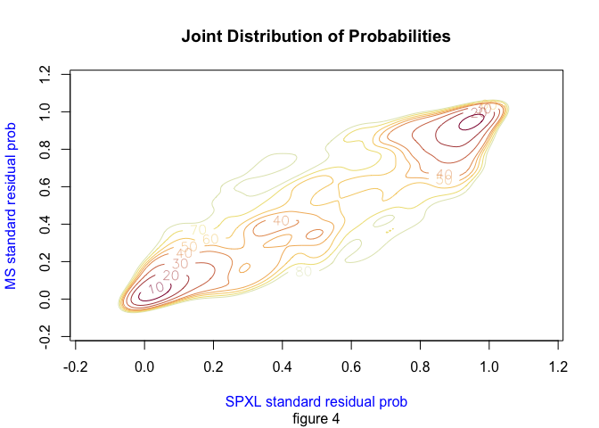

#### AIC & BIC

$$
AIC = -2*log[\hat{L(\theta})]+2p, \space \text{where } p \text{ is the length of } \theta 
$$

$$
BIC  = -2*log[\hat{L(\theta})]+p*log(n), \space \text{where } p \text{ is the length of } \theta
$$

<table class='gmisc_table' style='border-collapse: collapse; margin-top: 1em; margin-bottom: 1em;' >
<thead>
<tr><td colspan='3' style='text-align: left;'>
Table 4</td></tr>
<tr><th style='border-bottom: 1px solid grey; border-top: 2px solid grey;'></th>
<th style='font-weight: 900; border-bottom: 1px solid grey; border-top: 2px solid grey; text-align: center;'>AIC</th>
<th style='font-weight: 900; border-bottom: 1px solid grey; border-top: 2px solid grey; text-align: center;'>BIC</th>
</tr>
</thead>
<tbody>
<tr>
<td style='text-align: left;'>t-copula</td>
<td style='text-align: center;'>-1805.28</td>
<td style='text-align: center;'>-1793.62</td>
</tr>
<tr>
<td style='text-align: left;'>guassian</td>
<td style='text-align: center;'>-1716.47</td>
<td style='text-align: center;'>-1710.64</td>
</tr>
<tr>
<td style='text-align: left;'>gumbel</td>
<td style='text-align: center;'>-1605.09</td>
<td style='text-align: center;'>-1599.26</td>
</tr>
<tr>
<td style='border-bottom: 2px solid grey; text-align: left;'>clayton</td>
<td style='border-bottom: 2px solid grey; text-align: center;'>-1605.09</td>
<td style='border-bottom: 2px solid grey; text-align: center;'>-1599.26</td>
</tr>
</tbody>
</table>

## Residual Analysis

### SPXL

Figure 5.1 shows the volatility of SPXL log returns superimposed with
the predicted standard deviation,$\sigma$, for the GARCH(1,1) function.
The GARCH(1,1) predicts the volatility well. The standard residuals have
a mean of -0.01818 and a standard deviation of 0.99950. Figure 5.4 and
figure 5.5 indicate that the standard residual lag terms are not
correlated and that the data is stationary. A Ljung-Box test for
standard residuals and standard residual squared confirms no
autocorrelation (Appendix C).

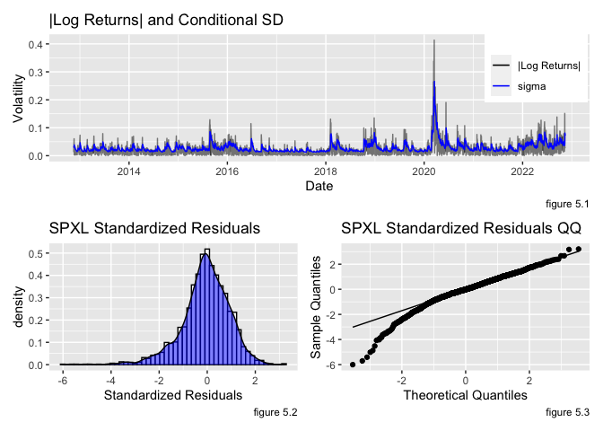

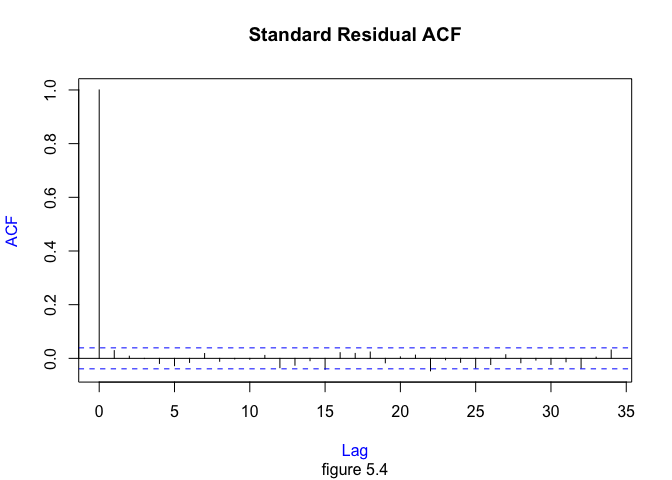

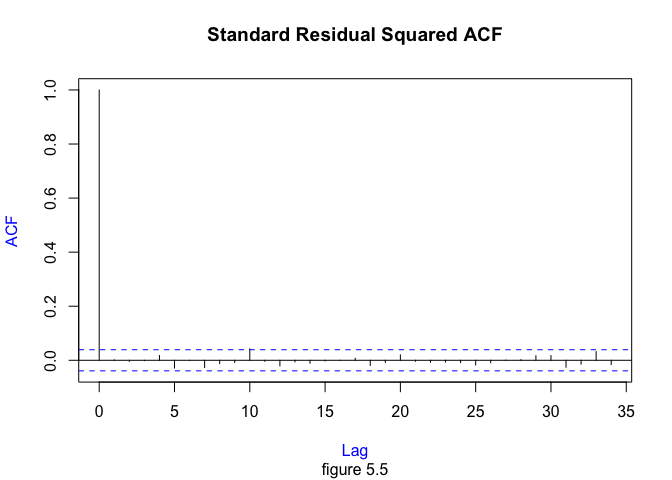

### Morgan Stanley

Figure 6.1 shows the volatility of MS log returns superimposed with the
predicted standard deviation,$\sigma$, for the GARCH(1,1) function. The
GARCH(1,1) predicts the volatility well. The standard residuals have a
mean of -0.024100 and a standard deviation of 0.99933. Figures 6.4 and
6.5 indicate that the standard residual lag terms are not correlated and
that the data is stationary.

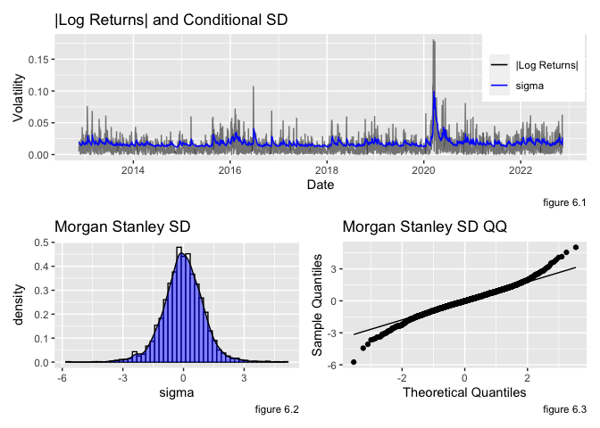

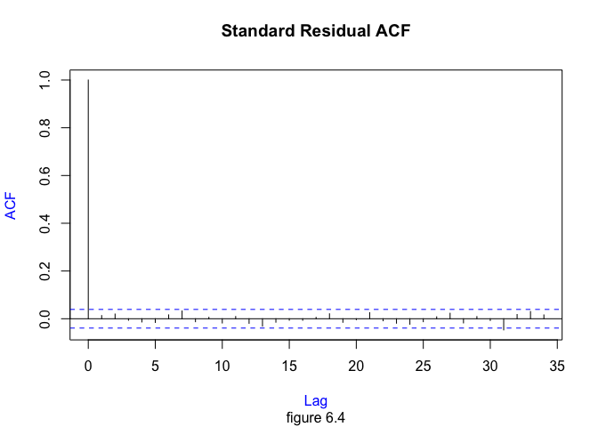


## Risk Calculation

The Value-at-Risk (VaR) is calculated for different portfolio
allocations between SPXL and MS$(\rho = .1,.2,...,.9)$. To get an
accurate measure, a sample of 10,000 standard residuals are taken from
the t-copula distribution. It is important to note that the sample
maintains marginal distributions and associations but does not have a
time dimension. The sampled residuals are substituted into the
$AR(1) + GARCH(1,1)$ model along with the 11/15/22 portfolio forecast
(equation 3). The output of this process is a distribution of possible
t+1 forecasts for each portfolio allocation.

<span id="eq-3">$$  
\begin{bmatrix}
P_{1,\rho = .1}^t & \cdots & P_{1,\rho = .9}^t \\
\vdots & \ddots & \vdots \\
P_{n,\rho = .1}^t & \cdots & P_{n,\rho = .9}^t
\end{bmatrix} =
\begin{bmatrix}
(\mu + \phi X_{t-1} + \sigma_t \epsilon_1^{*}) &  (\tilde{\mu} + \tilde{\phi} \tilde{X_{t-1}} + \tilde{\sigma_t} \tilde{\epsilon}_1^{*}) \\
\vdots & \vdots\\
(\mu + \phi X_{t-1} + \sigma_t \epsilon_n^{*}) &  (\tilde{\mu} + \tilde{\phi} \tilde{X_{t-1}} + \tilde{\sigma_t} \tilde{\epsilon}_n^{*}) \\
\end{bmatrix}
\begin{bmatrix}
\rho_{\rho = .1} & (1-\rho_{\rho = .1}) \\
\vdots & \vdots \\
\rho_{\rho = .9} & (1-\rho_{\rho = .9})
\end{bmatrix}^T
 \qquad(3)$$</span>

$$  
\text{where } n=10,000, \text{ and } \sigma_t
 \text{ is a GARCH(1,1) process}
$$

Table 6 shows the VaR and confidence intervals for different shares of
SPXL in the portfolio. The VaR is calculated by using the results from
equation 3 and estimating the .01 quantile for the return distribution
or the .99 upper quantile of the loss distribution. A bootstrapping
method (B = 5,000) is used to calculate the confidence intervals at 95%
confidence. The code for the bootstrap is found in Appendix E.

Portfolios can reduce risk by decreasing the portfolio’s exposure to
SPXL. For example, if the portfolio is 90% SPXL, there is a 1% chance of
losing more than 0.118 cents per dollar invested. If the portfolio is
10% SPXL, there is a 1% chance of losing more than 0.054 cents per
dollar invested. However, it should be noted that VaR discriminates
against diversifying stock portfolios.

<table class='gmisc_table' style='border-collapse: collapse; margin-top: 1em; margin-bottom: 1em;' >
<thead>
<tr><td colspan='4' style='text-align: left;'>
Table 6</td></tr>
<tr>
<th style='font-weight: 900; border-bottom: 1px solid grey; border-top: 2px solid grey; text-align: center;'>rho_</th>
<th style='font-weight: 900; border-bottom: 1px solid grey; border-top: 2px solid grey; text-align: center;'>_VaR_</th>
<th style='font-weight: 900; border-bottom: 1px solid grey; border-top: 2px solid grey; text-align: center;'>_CI lower_</th>
<th style='font-weight: 900; border-bottom: 1px solid grey; border-top: 2px solid grey; text-align: center;'>_CI upper</th>
</tr>
</thead>
<tbody>
<tr>
<td style='text-align: center;'>0.1</td>
<td style='text-align: center;'>0.05371</td>
<td style='text-align: center;'>0.05369</td>
<td style='text-align: center;'>0.05372</td>
</tr>
<tr>
<td style='text-align: center;'>0.2</td>
<td style='text-align: center;'>0.05908</td>
<td style='text-align: center;'>0.05906</td>
<td style='text-align: center;'>0.0591</td>
</tr>
<tr>
<td style='text-align: center;'>0.3</td>
<td style='text-align: center;'>0.06571</td>
<td style='text-align: center;'>0.06568</td>
<td style='text-align: center;'>0.06573</td>
</tr>
<tr>
<td style='text-align: center;'>0.4</td>
<td style='text-align: center;'>0.07323</td>
<td style='text-align: center;'>0.0732</td>
<td style='text-align: center;'>0.07326</td>
</tr>
<tr>
<td style='text-align: center;'>0.5</td>
<td style='text-align: center;'>0.0814</td>
<td style='text-align: center;'>0.08137</td>
<td style='text-align: center;'>0.08143</td>
</tr>
<tr>
<td style='text-align: center;'>0.6</td>
<td style='text-align: center;'>0.09004</td>
<td style='text-align: center;'>0.09001</td>
<td style='text-align: center;'>0.09008</td>
</tr>
<tr>
<td style='text-align: center;'>0.7</td>
<td style='text-align: center;'>0.09903</td>
<td style='text-align: center;'>0.099</td>
<td style='text-align: center;'>0.09907</td>
</tr>
<tr>
<td style='text-align: center;'>0.8</td>
<td style='text-align: center;'>0.10828</td>
<td style='text-align: center;'>0.10824</td>
<td style='text-align: center;'>0.10832</td>
</tr>
<tr>
<td style='border-bottom: 2px solid grey; text-align: center;'>0.9</td>
<td style='border-bottom: 2px solid grey; text-align: center;'>0.11773</td>
<td style='border-bottom: 2px solid grey; text-align: center;'>0.11769</td>
<td style='border-bottom: 2px solid grey; text-align: center;'>0.11777</td>
</tr>
</tbody>
</table>

## Appendix

### A. Augmented Dicky Fuller

#### SPXL

``` r
adf.test(SPXL$log.returns) 
```


        Augmented Dickey-Fuller Test

    data:  SPXL$log.returns
    Dickey-Fuller = -13.197, Lag order = 13, p-value = 0.01
    alternative hypothesis: stationary

#### Morgan Stanley

``` r
adf.test(MS$log.returns) 
```


        Augmented Dickey-Fuller Test

    data:  MS$log.returns
    Dickey-Fuller = -13.238, Lag order = 13, p-value = 0.01
    alternative hypothesis: stationary

### B. Ljung-Box Test on Log Returns

#### SPXL

``` r
Box.test(SPXL$log.returns, lag = 10, type = "Ljung-Box") 
```


        Box-Ljung test

    data:  SPXL$log.returns
    X-squared = 246.56, df = 10, p-value < 2.2e-16

#### Morgan Stanley

``` r
Box.test(MS$log.returns, lag = 10, type = "Ljung-Box") 
```


        Box-Ljung test

    data:  MS$log.returns
    X-squared = 102.45, df = 10, p-value < 2.2e-16

### C. AR+GARCH Model Fits

#### SPXL

``` r
spxl.ar.garch
```


    *---------------------------------*
    *          GARCH Model Fit        *
    *---------------------------------*

    Conditional Variance Dynamics   
    -----------------------------------
    GARCH Model : sGARCH(1,1)
    Mean Model  : ARFIMA(1,0,0)
    Distribution    : norm 

    Optimal Parameters
    ------------------------------------
            Estimate  Std. Error  t value Pr(>|t|)
    mu      0.002462    0.000385   6.3941 0.000000
    ar1    -0.060890    0.022523  -2.7035 0.006862
    omega   0.000039    0.000005   7.2586 0.000000
    alpha1  0.239297    0.023844  10.0361 0.000000
    beta1   0.733169    0.021450  34.1806 0.000000

    Robust Standard Errors:
            Estimate  Std. Error  t value Pr(>|t|)
    mu      0.002462    0.000393   6.2619 0.000000
    ar1    -0.060890    0.020594  -2.9566 0.003110
    omega   0.000039    0.000008   4.7514 0.000002
    alpha1  0.239297    0.035486   6.7434 0.000000
    beta1   0.733169    0.030589  23.9683 0.000000

    LogLikelihood : 5716.828 

    Information Criteria
    ------------------------------------
                        
    Akaike       -4.5404
    Bayes        -4.5288
    Shibata      -4.5404
    Hannan-Quinn -4.5362

    Weighted Ljung-Box Test on Standardized Residuals
    ------------------------------------
                            statistic p-value
    Lag[1]                      2.093  0.1480
    Lag[2*(p+q)+(p+q)-1][2]     2.174  0.1605
    Lag[4*(p+q)+(p+q)-1][5]     2.960  0.4415
    d.o.f=1
    H0 : No serial correlation

    Weighted Ljung-Box Test on Standardized Squared Residuals
    ------------------------------------
                            statistic p-value
    Lag[1]                   0.007098  0.9329
    Lag[2*(p+q)+(p+q)-1][5]  0.762508  0.9106
    Lag[4*(p+q)+(p+q)-1][9]  2.411590  0.8506
    d.o.f=2

    Weighted ARCH LM Tests
    ------------------------------------
                Statistic Shape Scale P-Value
    ARCH Lag[3]  0.005095 0.500 2.000  0.9431
    ARCH Lag[5]  1.851577 1.440 1.667  0.5050
    ARCH Lag[7]  2.905508 2.315 1.543  0.5316

    Nyblom stability test
    ------------------------------------
    Joint Statistic:  1.5914
    Individual Statistics:              
    mu     0.06852
    ar1    0.03956
    omega  0.25967
    alpha1 0.80986
    beta1  0.86100

    Asymptotic Critical Values (10% 5% 1%)
    Joint Statistic:         1.28 1.47 1.88
    Individual Statistic:    0.35 0.47 0.75

    Sign Bias Test
    ------------------------------------
                       t-value      prob sig
    Sign Bias           3.6434 0.0002746 ***
    Negative Sign Bias  0.7840 0.4331276    
    Positive Sign Bias  0.1474 0.8828670    
    Joint Effect       20.7247 0.0001201 ***


    Adjusted Pearson Goodness-of-Fit Test:
    ------------------------------------
      group statistic p-value(g-1)
    1    20     132.9    4.079e-19
    2    30     156.6    1.878e-19
    3    40     173.2    7.770e-19
    4    50     186.5    6.582e-18


    Elapsed time : 0.1484251 

#### Morgan Stanley

``` r
ms.ar.garch
```


    *---------------------------------*
    *          GARCH Model Fit        *
    *---------------------------------*

    Conditional Variance Dynamics   
    -----------------------------------
    GARCH Model : sGARCH(1,1)
    Mean Model  : ARFIMA(1,0,0)
    Distribution    : norm 

    Optimal Parameters
    ------------------------------------
            Estimate  Std. Error  t value Pr(>|t|)
    mu      0.001128    0.000322  3.50530 0.000456
    ar1    -0.002758    0.021890 -0.12601 0.899725
    omega   0.000022    0.000006  3.69389 0.000221
    alpha1  0.116477    0.020897  5.57401 0.000000
    beta1   0.818575    0.034919 23.44191 0.000000

    Robust Standard Errors:
            Estimate  Std. Error  t value Pr(>|t|)
    mu      0.001128    0.000314  3.59431 0.000325
    ar1    -0.002758    0.022911 -0.12039 0.904172
    omega   0.000022    0.000012  1.88301 0.059699
    alpha1  0.116477    0.044049  2.64429 0.008186
    beta1   0.818575    0.071651 11.42454 0.000000

    LogLikelihood : 6626.937 

    Information Criteria
    ------------------------------------
                        
    Akaike       -5.2639
    Bayes        -5.2523
    Shibata      -5.2639
    Hannan-Quinn -5.2597

    Weighted Ljung-Box Test on Standardized Residuals
    ------------------------------------
                            statistic p-value
    Lag[1]                     0.4504  0.5022
    Lag[2*(p+q)+(p+q)-1][2]    0.9439  0.7731
    Lag[4*(p+q)+(p+q)-1][5]    1.6089  0.8193
    d.o.f=1
    H0 : No serial correlation

    Weighted Ljung-Box Test on Standardized Squared Residuals
    ------------------------------------
                            statistic p-value
    Lag[1]                     0.5593  0.4545
    Lag[2*(p+q)+(p+q)-1][5]    2.3264  0.5436
    Lag[4*(p+q)+(p+q)-1][9]    4.3052  0.5379
    d.o.f=2

    Weighted ARCH LM Tests
    ------------------------------------
                Statistic Shape Scale P-Value
    ARCH Lag[3]     1.037 0.500 2.000  0.3085
    ARCH Lag[5]     2.562 1.440 1.667  0.3599
    ARCH Lag[7]     3.654 2.315 1.543  0.3992

    Nyblom stability test
    ------------------------------------
    Joint Statistic:  0.7932
    Individual Statistics:              
    mu     0.05869
    ar1    0.12593
    omega  0.36473
    alpha1 0.34567
    beta1  0.45600

    Asymptotic Critical Values (10% 5% 1%)
    Joint Statistic:         1.28 1.47 1.88
    Individual Statistic:    0.35 0.47 0.75

    Sign Bias Test
    ------------------------------------
                       t-value    prob sig
    Sign Bias          0.06294 0.94982    
    Negative Sign Bias 1.99395 0.04627  **
    Positive Sign Bias 0.34434 0.73062    
    Joint Effect       6.38706 0.09422   *


    Adjusted Pearson Goodness-of-Fit Test:
    ------------------------------------
      group statistic p-value(g-1)
    1    20     51.74    7.230e-05
    2    30     65.88    1.085e-04
    3    40     80.38    1.079e-04
    4    50    100.38    2.134e-05


    Elapsed time : 0.139806 

### D. AR and GARCH functions

    #| echo: FALSE
    ar1 <- function(mu, phi, x_prev) {
      x = mu*(1-phi) + phi * x_prev
      return(as.numeric(x))
    }

    garch1.1 <- function(omega, alpha, beta, e_prev, sigma_prev) {
      sigma_sq <- omega + alpha*(e_prev^2) + beta*(sigma_prev^2)
      sqrt(sigma_sq) %>% as.numeric() %>% return()
    }

### E. Bootstrap Confidence Intervals

``` r
B <- 5000 # number of resamples for bootstrap
alpha <- 0.01 # alpha value for var equation
gamma <- 0.95 # confidence interval

VAR <- matrix(data = NA, ncol = nrow(rho), nrow = 0)
for (i in 1:B) {
  syn <- rCopula(copula = tCopula(t_params[1], df = t_params[2], dim = 2), n = 10000)

  syn[,1] <- qstd(syn[,1], mean = spxl.theta[1], sd = spxl.theta[2], nu = spxl.theta[3])
  syn[,2] <- qstd(syn[,2], mean = ms.theta[1], sd = ms.theta[2], nu = ms.theta[3])
  # 
  syn <- cbind(syn, matrix(
    rep(NA,nrow(syn)*2), ncol = 2)
  )
  syn[,3] <-
  ar1(mu = spxl.params[1], phi = spxl.params[2], x_prev = SPXL$log.returns[nrow(SPXL)]) +
  garch1.1(omega = spxl.params[3], alpha = spxl.params[4], beta = spxl.params[5],
           e_prev = SPXL$resid[nrow(SPXL)], sigma_prev = SPXL$sigma[nrow(SPXL)]) * syn[,1]

  syn[,4] <-
  ar1(mu = ms.params[1], phi = ms.params[2], x_prev = MS$log.returns[nrow(MS)]) +
  garch1.1(omega = ms.params[3], alpha = ms.params[4], beta = ms.params[5],
           e_prev = MS$resid[nrow(MS)], sigma_prev = MS$sigma[nrow(MS)]) * syn[,2]

  P <- syn[,c(3,4)] %*% t(rho)
  V <- qstd(alpha, mean = colMeans(P), sd = apply(P,2,sd)) * -1
  VAR <- rbind(VAR,V)
  rm(syn,P,V)
}

var_table <- matrix(data=NA, ncol = 3, nrow = 0)
for (i in 1:ncol(VAR)) {
  a <- lm(VAR[,i]~ 1)
  ci <- confint(a,level = gamma)
  mu <- mean(VAR[,i])
  var_table <- rbind(var_table, c(mu,ci[,1],ci[,2]))
}
```

### F. Project Code

#### Data Sets

libraries used for project

``` r
library(tidyverse)
library(quantmod)
library(dplyr)
library(sn)
library(MASS)
library(fGarch)
library(ks)
library(copula)
library(patchwork)
library(rugarch)
library(tseries)
library(broom)
library(htmlTable)
```

Pulling data from Yahoo Finance

``` r
getSymbols("SPXL;MS",
           from = "2012/11/15",
           to = "2022/11/15",
           periodicity = "d",
           src = "yahoo")
```

Converting Yahoo data to dataframes

``` r
SPXL <- SPXL %>% 
  data.frame()
MS <- MS %>% 
  data.frame()
```

Calculating log returns

``` r
SPXL <- SPXL %>%
  mutate(log.returns = log(SPXL.Adjusted) - log(dplyr::lag(SPXL.Adjusted))) %>%
  na.omit()

MS <- MS %>% 
  mutate(log.returns = log(MS.Adjusted) - log(dplyr::lag(MS.Adjusted))) %>%
  na.omit()

SPXL <- SPXL %>% mutate(date = rownames(SPXL))
MS <- MS %>% mutate(date = rownames(MS))
```

Plotting stock price over past 10 year

``` r
a <- ggplot(SPXL) +
  geom_line(aes(as.Date(date),SPXL.Adjusted)) +
  labs(title = "SPXL", y = "Share Price", x = "Date", caption = "Figure 1.1")
b <- ggplot(MS) +
  geom_line(aes(as.Date(date),MS.Adjusted)) +
  labs(title = "Morgan Stanley", y = "Share Price", x = "Date", 
       caption = "Figure 1.2")

a/b
```

``` r
mean(SPXL$log.returns)
sd(SPXL$log.returns)
lm(log.returns ~lag(log.returns), data = SPXL)
```

Exploring SPXL with plots

``` r
time_spxl <- ggplot(SPXL) +
  geom_line(aes(as.Date(date), log.returns)) +
  labs(title = "SPXL Log Returns", x = "Date", y = "Log Returns",
       caption = "Figure 2.1")

distr_spxl <- ggplot(SPXL) +
  geom_histogram(aes(log.returns, ..density..), fill = "white", color = "black",
                 bins = 50) +
  geom_density(aes(log.returns), fill = "blue", alpha = .3) +
  labs(title = "SPXL Distribution", caption = "Figure 2.3")

qq_spxl <- ggplot(SPXL, aes(sample = log.returns)) +
  stat_qq() + 
  stat_qq_line() +
  labs(title = "SPXL QQ", x = "Theoretical Quantiles", y = "Sample Quantiles", 
       caption = "Figure 2.4")

a <- ggplot(SPXL) +
  geom_line(aes(as.Date(date), abs(log.returns))) +
  geom_smooth(aes(as.Date(date), abs(log.returns))) +
  labs(title = "Volatility of SPXL Log Returns", x = "Date", 
       y = "|Log Returns|", caption = "Figure 2.2")

time_spxl / a /(distr_spxl | qq_spxl) 
```

ACF for SPXL log returns

``` r
acf(SPXL$log.returns, 
    main = "ACF", 
    sub="figure 2.5",
    col.lab = "blue")
```

``` r
mean(MS$log.returns)
sd(MS$log.returns)
```

Exploring MS in plots

``` r
distr_ms <- ggplot(MS) +
  geom_histogram(aes(log.returns, ..density..), fill = "white", 
                 color = "black", bins = 50) +
  geom_density(aes(log.returns), fill = "blue", alpha = .3) +
  labs(title = "MS Distribution", caption = "Figure 3.3")

time_ms <- ggplot(MS) +
  geom_line(aes(as.Date(date), log.returns)) +
  labs(title = "MS Log Returns", x = "Date", y = "Log Returns", 
       caption = "Figure 3.1")

qq_ms <- ggplot(MS, aes(sample = log.returns)) +
  stat_qq() + 
  stat_qq_line() +
  labs(title = "MS QQ", x = "Theoretical Quantiles", y = "Sample Quantiles", 
       caption = "Figure 3.4")

a <- ggplot(MS) +
  geom_line(aes(as.Date(date), abs(log.returns))) +
  geom_smooth(aes(as.Date(date), abs(log.returns))) +
  labs(title = "Volatility of MS Log Returns", x = "Date", y = "|Log Returns|", 
       caption = "Figure 3.2")

time_ms / a /(distr_ms | qq_ms)
```

``` r
acf(MS$log.returns, 
    main = "ACF", 
    sub="figure 3.5",
    col.lab = "blue")
```

#### Creating the AR(1) + GARCH(1,1)

``` r
ar.garch <- ugarchspec(mean.model = list(armaOrder = c(1,0)),
                       variance.model = list(garchOrder = c(1,1)))
```

``` r
spxl.ar.garch <- ugarchfit(data = SPXL$log.returns, 
                           spec = ar.garch)
```

``` r
ms.ar.garch <- ugarchfit(data = MS$log.returns, 
                           spec = ar.garch)
```

creating parameter table

``` r
a <- coef(spxl.ar.garch) %>% tidy()
a[,2] <- round(a[,2], 5)
names(a) <- c("Parameters", "SPXL")
b <- coef(ms.ar.garch) %>% tidy()
b[,2] <- round(b[,2], 5)
names(b) <- c("MLE", "MS")
cbind(a, b[,2]) %>% htmlTable(caption = "Table 1")
```

#### Residual Fits

``` r
spxl.e <- residuals(spxl.ar.garch, standardize=TRUE)
spxl.fit <- fitdistr(spxl.e, "t")

ms.e <- residuals(ms.ar.garch, standardize=T) 
ms.fit <- fitdistr(ms.e, "t")
```

``` r
spxl.theta <- spxl.fit$estimate
ms.theta <- ms.fit$estimate
```

``` r
library(htmlTable)
t.mle = matrix(rep(NA,9), ncol = 3)
t.mle[,1] <- c("mean", "sd", "df")
t.mle[,2] <- round(spxl.theta,5)
t.mle[,3] <- round(ms.theta,5)
colnames(t.mle) <- c("Parameter", "SPXL", "MS")
t.mle %>% htmlTable(caption = "Table 2")
```

#### Copula Fits

##### set-up

Making a table for AICs and BICs

``` r
AICs <- matrix(rep(NA,8), ncol = 2)
rownames(AICs) <- c("t-copula", "guassian", "gumbel", "clayton")
colnames(AICs) <- c("AIC", "BIC")
```

Calculating associations

``` r
u.spxl.e <- pstd(spxl.e, mean = spxl.theta[1], sd = spxl.theta[2], 
                 nu = spxl.theta[3])
u.ms.e <- pstd(ms.e, mean = ms.theta[1], sd = ms.theta[2], nu = ms.theta[3])

tau <- 
  cor.test(as.numeric(u.spxl.e),as.numeric(u.ms.e),method="kendall")$estimate
omega <- sin(tau*pi/2)
```

Table for associations

``` r
co <- matrix(rep(NA, 3),ncol=1)
colnames(co) <- c("Error Associations")
rownames(co) <- c("pearson", "kendall", "omega")
co[,1] <- round(c(cor(spxl.e, ms.e), tau, omega),5)

co %>% htmlTable(caption = "Table 3")
```

Plot non-parametric copula

``` r
U.hat <- data.frame(u.spxl.e, u.ms.e)
names(U.hat) <- c("SPXL e", "MS e")
fhatU <- kde(x=U.hat,H=Hscv(x=U.hat))#nonparametric density estimation 
plot(fhatU,cont=seq(10,80,10), 
     main = "Joint Distribution of Probabilities",
     xlab="SPXL standard residual prob",
        ylab="MS standard residual prob",
        sub="figure 4",
     col.lab = "blue") #contour plots
```

Creating a function to calculate AIC and BIC

``` r
my_aic <- function(L,p) {
  aic <- -2*L + 2*p
  return(aic)
}
my_bic <- function(L,n,p) {
  bic <- -2*L + p*log(n)
  return(bic)
}
```

#### Copulas

``` r
Ct <- fitCopula(copula=tCopula(dim=2),data=U.hat,method="ml",start=c(omega,10)) 

t_params <- coef(Ct)
t_logLik <- loglikCopula(param=t_params,u=as.matrix(U.hat),
                         copula=tCopula(dim=2)) 

AICs[1,] <- c(my_aic(t_logLik, 2), my_bic(t_logLik, nrow(u.spxl.e),2)) %>%
  round(2)
```

``` r
Cguas <- fitCopula(copula=normalCopula(dim=2),data=U.hat,method="ml",
                   start=c(omega))

guas_params <- coef(Cguas)
guas_logLik <- loglikCopula(param=guas_params,u=as.matrix(U.hat),
                            copula=normalCopula(dim=2)) 

AICs[2,] <- c(my_aic(guas_logLik, 1), my_bic(guas_logLik, nrow(u.spxl.e),1)) %>%
  round(2)
```

``` r
Cgum <- fitCopula(copula=gumbelCopula(dim=2),data=U.hat,method="ml",start=1) 

gum_params <- coef(Cgum)
gum_logLik <- loglikCopula(param=gum_params,u=as.matrix(U.hat),
                           copula=gumbelCopula(dim=2))

AICs[3,] <- c(my_aic(gum_logLik, 1), my_bic(gum_logLik, nrow(u.spxl.e),1)) %>% 
  round(2)
```

``` r
Cclay <- fitCopula(copula=claytonCopula(dim=2),data=U.hat,method="ml",start=1) 
clay_params <- coef(Cgum)
clay_logLik <- loglikCopula(param=gum_params,u=as.matrix(U.hat),
                            copula=gumbelCopula(dim=2))

AICs[4,] <- c(my_aic(clay_logLik, 1), my_bic(clay_logLik, nrow(u.spxl.e),1)) %>%
  round(2)
```

Output the Copula AICs and BICs in table

``` r
AICs %>% htmlTable(caption = "Table 4")
```

#### Residual Analysis

##### SPXL

``` r
mean(SPXL$resid.std)
sd(SPXL$resid.std)
```

Exploring the SPXL residuals with plots

``` r
SPXL <- SPXL %>% mutate(fitted = as.vector(fitted(spxl.ar.garch))) %>%
  mutate(resid = as.vector(residuals(spxl.ar.garch))) %>%
  mutate(resid.std = as.vector(residuals(spxl.ar.garch, standardize=T))) %>%
  mutate(sigma = as.vector(sigma(spxl.ar.garch)))

a <-ggplot(SPXL, aes(as.Date(date))) +
  geom_line(aes(y = abs(log.returns), colour = "|Log Returns|"),alpha = .5) + 
  geom_line(aes(y = sigma, colour = "sigma")) + 
  scale_colour_manual("", 
                      breaks = c("|Log Returns|", "sigma"),
                      values = c("black","blue")) +
  labs(title = "|Log Returns| and Conditional SD", x = "Date", y = "Volatility", 
       caption = "figure 5.1") +
  theme(legend.position=c(.9,.75))

b <- ggplot(SPXL, aes(resid.std, ..density..)) +
  geom_histogram(fill = "white", color = "black", bins = 50) +
  geom_density(fill = "blue", alpha = .5) +
  labs(title = "SPXL Standardized Residuals", x = "Standardized Residuals", 
       y = "density", caption = "figure 5.2")

c <- ggplot(SPXL, aes(sample = resid.std)) +
  stat_qq() + 
  stat_qq_line() +
  labs(title = "SPXL Standardized Residuals QQ", x = "Theoretical Quantiles", 
       y = "Sample Quantiles", caption = "figure 5.3")

a / (b | c)
```

``` r
acf(SPXL$resid.std, 
    main = "Standard Residual ACF", 
    sub="figure 5.4",
    col.lab = "blue")
acf(SPXL$resid.std^2, 
    main = "Standard Residual Squared ACF", 
    sub="figure 5.5",
    col.lab = "blue")
```

##### Morgan Stanley

``` r
mean(MS$resid.std)
sd(MS$resid.std)
```

Exploring the MS residuals with plots

``` r
MS <- MS %>% mutate(fitted = as.vector(fitted(ms.ar.garch))) %>%
  mutate(resid = as.vector(residuals(ms.ar.garch))) %>%
  mutate(resid.std = as.vector(residuals(ms.ar.garch, standardize=T))) %>%
  mutate(sigma = as.vector(sigma(ms.ar.garch)))

a <-ggplot(MS, aes(as.Date(date))) +
  geom_line(aes(y = abs(log.returns), colour = "|Log Returns|"),alpha = .5) + 
  geom_line(aes(y = sigma, colour = "sigma")) + 
  scale_colour_manual("", 
                      breaks = c("|Log Returns|", "sigma"),
                      values = c("black","blue")) +
  labs(title = "|Log Returns| and Conditional SD", x = "Date", 
       y = "Volatility", caption = "figure 6.1") +
  theme(legend.position=c(.9,.75))

b <- ggplot(MS, aes(resid.std, ..density..)) +
  geom_histogram(fill = "white", color = "black", bins = 50) +
  geom_density(fill = "blue", alpha = .5) +
  labs(title = "Morgan Stanley SD", x = "sigma", y = "density", 
       caption = "figure 6.2")

c <- ggplot(MS, aes(sample = resid.std)) +
  stat_qq() + 
  stat_qq_line() +
  labs(title = "Morgan Stanley SD QQ", x = "Theoretical Quantiles", 
       y = "Sample Quantiles", caption = "figure 6.3")

a / (b | c)
```

``` r
acf(MS$resid.std, 
    main = "Standard Residual ACF", 
    sub="figure 6.4",
    col.lab = "blue")
acf(MS$resid.std^2, 
    main = "Standard Residual Squared ACF", 
    sub="figure 6.5",
    col.lab = "blue")
```

#### Risk Calculations

Creating a function to forcast conditional mean and conditional variance

``` r
ar1 <- function(mu, phi, x_prev) {
  x = mu*(1-phi) + phi * x_prev
  return(as.numeric(x))
}
garch1.1 <- function(omega, alpha, beta, e_prev, sigma_prev) {
  sigma_sq <- omega + alpha*(e_prev^2) + beta*(sigma_prev^2)
  sqrt(sigma_sq) %>% as.numeric() %>% return()
}
```

Getting the parameters from the forcasting model and making a $\rho$
matrix

``` r
spxl.params <- coef(spxl.ar.garch)
ms.params <- coef(ms.ar.garch)

rho <- matrix(rep(NA,18), ncol = 2)
rho[,1] <- seq(.1,.9,.1)
rho[,2] <- 1-rho[,1]
```

Using Bootstrap method to calculate VaR and its CIs

``` r
B <- 5000 # number of resamples for bootstrap
alpha <- 0.01 # alpha value for var equation
gamma <- 0.95 # confidence interval

VAR <- matrix(data = NA, ncol = nrow(rho), nrow = 0)
for (i in 1:B) {
  syn <- rCopula(copula = tCopula(t_params[1], df = t_params[2], dim = 2), n = 10000)

  syn[,1] <- qstd(syn[,1], mean = spxl.theta[1], sd = spxl.theta[2], nu = spxl.theta[3])
  syn[,2] <- qstd(syn[,2], mean = ms.theta[1], sd = ms.theta[2], nu = ms.theta[3])
  # 
  syn <- cbind(syn, matrix(
    rep(NA,nrow(syn)*2), ncol = 2)
  )
  syn[,3] <-
  ar1(mu = spxl.params[1], phi = spxl.params[2], x_prev = SPXL$log.returns[nrow(SPXL)]) +
  garch1.1(omega = spxl.params[3], alpha = spxl.params[4], beta = spxl.params[5],
           e_prev = SPXL$resid[nrow(SPXL)], sigma_prev = SPXL$sigma[nrow(SPXL)]) * syn[,1]

  syn[,4] <-
  ar1(mu = ms.params[1], phi = ms.params[2], x_prev = MS$log.returns[nrow(MS)]) +
  garch1.1(omega = ms.params[3], alpha = ms.params[4], beta = ms.params[5],
           e_prev = MS$resid[nrow(MS)], sigma_prev = MS$sigma[nrow(MS)]) * syn[,2]

  P <- syn[,c(3,4)] %*% t(rho)
  V <- qstd(alpha, mean = colMeans(P), sd = apply(P,2,sd)) * -1
  VAR <- rbind(VAR,V)
  rm(syn,P,V)
}

var_table <- matrix(data=NA, ncol = 3, nrow = 0)
for (i in 1:ncol(VAR)) {
  a <- lm(VAR[,i]~ 1)
  ci <- confint(a,level = gamma)
  mu <- mean(VAR[,i])
  var_table <- rbind(var_table, c(mu,ci[,1],ci[,2]))
}
```

Output VaR and CIs

``` r
var_table <- cbind(rho[,1], var_table) %>% round(5) 
colnames(var_table) <- c("rho_", "_VaR_", "_CI lower_", "_CI upper")
var_table %>%  htmlTable(caption = "Table 6")
```
