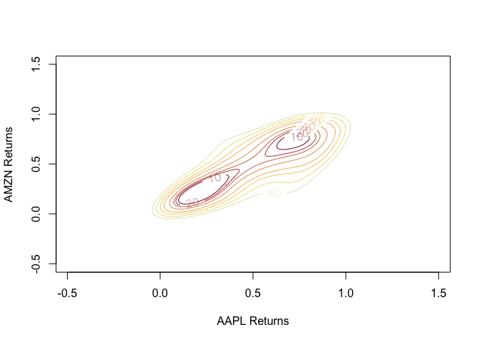
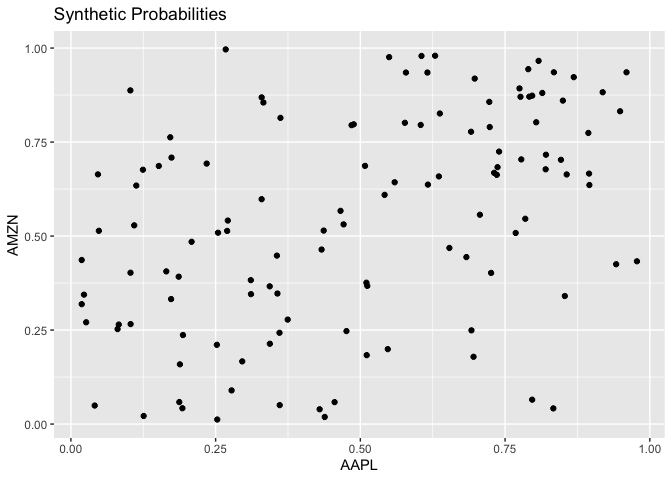
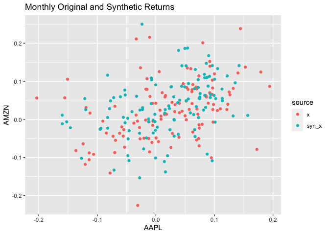
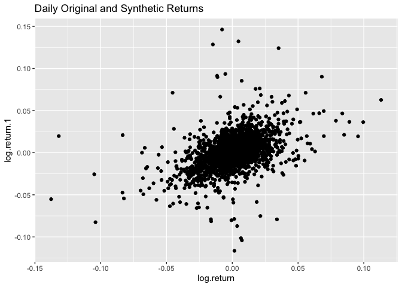

# Data Sets

## Intro

The goal of this project is to generate synthetic data from two
different stocks, while maintaining the marginal stock distributions and
the association between the two stocks. This is an important task
because stock data has a limited quantity within a given time interval.
It is obvious that there are only 12 observations of monthly data per
stock per year (120 for 10 years). Therefore, synthetic data can be
useful to proliferate the observations. One use case for the new data is
using it to build larger models that require more data such as ensemble
models or neural networks.

A careful step-by-step process is necessary to create the synthetic
data. First, consideration is taken when deciding two stocks that may
have a relevant relationship. Amazon and Apple are both multinational
technology companies. Amazon primary focus is e-commerce, but also
offers video steaming, cloud services, and more. Apple focuses in
computer and smart phone production, while offering cloud services, and
audio and video streaming. Both companies are tech giants and therefore
will likely have some relationship.

Monthly and daily data is downloaded from a creditable source, yahoo
finance, for the past 10 years. This analysis uses adjusted closed stock
prices to account for executive intervention in stock prices. The
adjusted prices are then converted to log returns. The monthly data is
taken from the first day of each month.

``` r
getSymbols("AAPL;AMZN",
           from = "2011/12/31",
           to = "2021/12/31",
           periodicity = "monthly")
```

``` r
AAPL$log.return <- log(AAPL$AAPL.Adjusted) - log(stats::lag(AAPL$AAPL.Adjusted))
AAPL <- AAPL[-1]

AMZN$log.return <- log(AMZN$AMZN.Adjusted) - log(stats::lag(AMZN$AMZN.Adjusted))
AMZN <- AMZN[-1]
```

# Marginals

The data is fitted to different marginal distributions (Normal, Skewed
Normal, Student’s T, and Skewed Student’s T) using a log-likelihood
optimization method to find optimal parameters (mean, standard
deviation, degrees-of-freedom, etc). The best fitting distribution is
selected by taking the minimum AIC, which in this case is Skewed
Student’s T for both stocks. The AICs are preferred over the BICs
because this data is intended for prediction use rather than causal
analysis.

### APPL Fits

#### Normal Distribution

``` r
x1 <- AAPL$log.return
start <- c(mean(x1), sd(x1))
logLik_nd <- function(theta) {
  f <- sum(-dnorm((x1 - theta[1])/theta[2],log=T))
  return(f)
}
aapl_mle_nd <- optim(start,logLik_nd, method = "L-BFGS-B",
                     lower = c(-0.1, 0.001, 2.1),
      upper = c(0.1, 1, 20))
```

    ## MLE = 0.02136 1

#### Skewed Normal Distribution

``` r
start <- c(mean(x1), sd(x1), 1)
logLik_sknd <- function(theta) {
  f <- -sum(log(sn::dsn(x1,xi = theta[1], omega = theta[2], alpha = theta[3])))
  return(f)
}
aapl_mle_sknd <- optim(start, logLik_sknd, method = "L-BFGS-B")
```

    ## MLE = 0.02052 0.07809 0.01358

#### Student’s T Distribution

``` r
#fitdistr(x1,"t")
start <- c(mean(x1), sd(x1), 5)
logLik_std <- function(theta) {
  f <- sum(-dstd(x1, mean = theta[1], sd = theta[2], nu = theta[3], log = T))
  return(f)
}
aapl_mle_std <- optim(start, logLik_std, method = "BFGS")
```

    ## MLE = 0.02193 0.07829 50.6818

#### Skewed Student’s T Distribution

``` r
aapl_mle_sstd <- sstdFit(x1)
theta <- aapl_mle_sstd$estimate
aapl_fit_sstd <- sum(-dsstd(x1, mean = theta[1], sd = theta[2], nu = theta[3], xi = theta[4], log = T))
```

    ## MLE = 0.02136 0.07808 33929.08 0.72871

### AMZN Fits

#### Normal Distribution

``` r
x1 <- AMZN$log.return
start <- c(mean(x1), sd(x1))
logLik_nd <- function(theta) {
  f <- sum(-dnorm((x1 - theta[1])/theta[2],log=T))
  return(f)
}
amzn_mle_nd <- optim(start,logLik_nd, method = "L-BFGS-B",
                     lower = c(-0.1, 0.001, 2.1),
      upper = c(0.1, 1, 20), hessian = TRUE)
```

    ## MLE = 0.02388 1

#### Skewed Normal Distribution

``` r
start <- c(mean(x1), sd(x1), 1)
logLik_sknd <- function(theta) {
  f <- -sum(log(sn::dsn(x1,xi = theta[1], omega = theta[2], alpha = theta[3])))
  return(f)
}
amzn_mle_sknd <- optim(start, logLik_sknd, method = "L-BFGS-B")
```

    ## MLE = -0.01937 0.08881 0.77095

#### Student’s T Distribution

``` r
amzn_std_fit <- fitdistr(x1,"t")
theta <- amzn_std_fit$estimate
amzn_mle_std <- sum(-dstd(x1, mean = theta[1], sd = theta[2], nu = theta[3], log = T))
```

    ## MLE = 0.02358 0.07242 15.33031

#### Skewed Student’s T Distribution

``` r
amzn_sstd_fit <- sstdFit(x1)
theta <- amzn_sstd_fit$estimate
amzn_mle_sstd <- sum(-dstd(x1, mean = theta[1], sd = theta[2], nu = theta[3], log = T))
```

    ## MLE = 0.02379 0.07756 17.16047 1.03012

#### Distribution AICs

The AICs, displayed below are calculated using the following formula:  
$$ 
AIC = -2\*log\[\hat{L(\theta})\]-2p, \space \text{where } p \text{ is the length of } \theta
$$

<table class="gmisc_table" style="border-collapse: collapse; margin-top: 1em; margin-bottom: 1em;">
<thead>
<tr>
<td colspan="3" style="text-align: left;">
AIC values for each Distribution
</td>
</tr>
<tr>
<th style="border-bottom: 1px solid grey; border-top: 2px solid grey;">
</th>
<th style="font-weight: 900; border-bottom: 1px solid grey; border-top: 2px solid grey; text-align: center;">
APPL
</th>
<th style="font-weight: 900; border-bottom: 1px solid grey; border-top: 2px solid grey; text-align: center;">
AMZN
</th>
</tr>
</thead>
<tbody>
<tr>
<td style="text-align: left;">
Normal
</td>
<td style="text-align: center;">
-13.3957986062418
</td>
<td style="text-align: center;">
-13.3957986062418
</td>
</tr>
<tr>
<td style="text-align: left;">
Skewed Normal
</td>
<td style="text-align: center;">
-15.8045421533921
</td>
<td style="text-align: center;">
-15.8173537840113
</td>
</tr>
<tr>
<td style="text-align: left;">
Student T
</td>
<td style="text-align: center;">
-15.8026231314453
</td>
<td style="text-align: center;">
-15.8141192459078
</td>
</tr>
<tr>
<td style="border-bottom: 2px solid grey; text-align: left;">
Skewed Student T
</td>
<td style="border-bottom: 2px solid grey; text-align: center;">
-17.8410668119987
</td>
<td style="border-bottom: 2px solid grey; text-align: center;">
-17.8215801406525
</td>
</tr>
</tbody>
</table>

#### SSTD Summary Statistics

The optimized parameters are below:

<table class="gmisc_table" style="border-collapse: collapse; margin-top: 1em; margin-bottom: 1em;">
<thead>
<tr>
<td colspan="3" style="text-align: left;">
Monthly Summary Statistics
</td>
</tr>
<tr>
<th style="border-bottom: 1px solid grey; border-top: 2px solid grey;">
</th>
<th style="font-weight: 900; border-bottom: 1px solid grey; border-top: 2px solid grey; text-align: center;">
Apple
</th>
<th style="font-weight: 900; border-bottom: 1px solid grey; border-top: 2px solid grey; text-align: center;">
Amazon
</th>
</tr>
</thead>
<tbody>
<tr>
<td style="text-align: left;">
mean
</td>
<td style="text-align: center;">
0.02136
</td>
<td style="text-align: center;">
0.02379
</td>
</tr>
<tr>
<td style="text-align: left;">
sd
</td>
<td style="text-align: center;">
0.07808
</td>
<td style="text-align: center;">
0.07756
</td>
</tr>
<tr>
<td style="text-align: left;">
df
</td>
<td style="text-align: center;">
33929.07552
</td>
<td style="text-align: center;">
17.16047
</td>
</tr>
<tr>
<td style="border-bottom: 2px solid grey; text-align: left;">
alpha
</td>
<td style="border-bottom: 2px solid grey; text-align: center;">
0.72871
</td>
<td style="border-bottom: 2px solid grey; text-align: center;">
1.03012
</td>
</tr>
</tbody>
</table>

# Copulas

### Set Up

Next, the optimized marginal parameters are used to create a copula.
This is done by estimating the probability of log returns from their
stocks’ respective marginal CDFs (P{return \< x}). The transformation
restricts the domain and creates a uniform(0,1) distribution of
probabilities. Kendall’s tau and correlation matrix are estimated below:

``` r
u1 <- psstd(x.aapl, mean = theta.aapl[1], sd = theta.aapl[2], nu = theta.aapl[3], xi = theta.aapl[4])
u2 <- psstd(x.amzn, mean = theta.amzn[1], sd = theta.amzn[2], nu = theta.amzn[3], xi = theta.amzn[4])

tau <- cor.test(as.numeric(u1),as.numeric(u2),method="kendall")$estimate

omega <- sin(tau*pi/2)
```

<table class="gmisc_table" style="border-collapse: collapse; margin-top: 1em; margin-bottom: 1em;">
<thead>
<tr>
<td colspan="2" style="text-align: left;">
Stock Associations
</td>
</tr>
<tr>
<th style="border-bottom: 1px solid grey; border-top: 2px solid grey;">
</th>
<th style="font-weight: 900; border-bottom: 1px solid grey; border-top: 2px solid grey; text-align: center;">
Estimates
</th>
</tr>
</thead>
<tbody>
<tr>
<td style="text-align: left;">
pearson
</td>
<td style="text-align: center;">
0.40103268806207
</td>
</tr>
<tr>
<td style="text-align: left;">
kendall
</td>
<td style="text-align: center;">
0.314057826520439
</td>
</tr>
<tr>
<td style="border-bottom: 2px solid grey; text-align: left;">
omega
</td>
<td style="border-bottom: 2px solid grey; text-align: center;">
0.473553409506591
</td>
</tr>
</tbody>
</table>

Below is the non-parametric probability density estimations for original
monthly data.


### Fits

Multiple copulas are fitted (Gaussian, Frank, T-Copula, Gumbel, and
Joe). Gumbel and Joe are included because Amazon and Apple have a
positive correlation. The Frank copula is chosen to represent to stocks
relationship because it has the lowest AIC.

#### Gaussian Copula

``` r
Cguas <- fitCopula(copula=normalCopula(dim=2),data=U.hat,method="ml",start=c(omega))
guas_params <- coef(Cguas)

guas_logLik <- loglikCopula(param=guas_params,u=as.matrix(U.hat),copula=normalCopula(dim=2)) 
```

#### Frank Copula

``` r
Cfr <- fitCopula(copula=frankCopula(dim=2),data=as.matrix(U.hat),method="ml", start=1) 
fr_params <- coef(Cfr)

fr_logLik <- loglikCopula(param=fr_params,u=as.matrix(U.hat),copula=frankCopula(dim=2)) 
```

#### T-Copula

``` r
Ct <- fitCopula(copula=tCopula(dim=2),data=U.hat,method="ml",start=c(omega,10)) # 10 is degrees of freedom
t_params <- coef(Ct)

t_logLik <- loglikCopula(param=t_params,u=as.matrix(U.hat),copula=tCopula(dim=2)) 
```

#### Gumbel Copula

``` r
Cgum <- fitCopula(copula=gumbelCopula(dim=2),data=U.hat,method="ml",start=1) 
gum_params <- coef(Cgum)

gum_logLik <- loglikCopula(param=gum_params,u=as.matrix(U.hat),copula=gumbelCopula(dim=2)) 
```

#### Joe Copula

``` r
Cjoe <- fitCopula(copula=joeCopula(dim=2),data=U.hat,method="ml",start=1)
joe_params <- coef(Cjoe)

joe_logLik <- loglikCopula(param=joe_params,u=as.matrix(U.hat),copula=joeCopula(dim=2)) 
```

#### Copula AICs

The Frank Copula is selected because it has the lowest AIC.
<table class="gmisc_table" style="border-collapse: collapse; margin-top: 1em; margin-bottom: 1em;">
<thead>
<tr>
<td colspan="2" style="text-align: left;">
Copula AICs
</td>
</tr>
<tr>
<th style="border-bottom: 1px solid grey; border-top: 2px solid grey;">
</th>
<th style="font-weight: 900; border-bottom: 1px solid grey; border-top: 2px solid grey; text-align: center;">
Copula
</th>
</tr>
</thead>
<tbody>
<tr>
<td style="text-align: left;">
Guassian
</td>
<td style="text-align: center;">
-19.7074789267802
</td>
</tr>
<tr>
<td style="text-align: left;">
Frank
</td>
<td style="text-align: center;">
-25.166691113622
</td>
</tr>
<tr>
<td style="text-align: left;">
Student’s T
</td>
<td style="text-align: center;">
-22.3466886451718
</td>
</tr>
<tr>
<td style="text-align: left;">
Gumbel
</td>
<td style="text-align: center;">
-18.0331739611557
</td>
</tr>
<tr>
<td style="border-bottom: 2px solid grey; text-align: left;">
Joe
</td>
<td style="border-bottom: 2px solid grey; text-align: center;">
-11.0676016559696
</td>
</tr>
</tbody>
</table>

# Simulated Data

#### Creating Synthetic Data

Synthetic data is generated using the following process. Using the
rCopula() function in R’s copula package, random probability values are
taken from the fitted copula. The randomness is subject to the copulas
distribution. These probabilities are of the stocks marginal
uniform(0,1) distribution. The probabilities can then be transformed
into stock log returns using the fitted Skewed Student’s T quantile
formula. The resulting quantities are synthetic values. Their data is
formatted as two columns (one per stock) with equal lengths. The
rCopula() function can produce any number of synthetic data points, but
for this analysis the same number of original stock returns is chosen.

``` r
syn_prob <- rCopula(copula = frankCopula(param = fr_params), n = length(x.aapl))
colnames(syn_prob) <- c("AAPL", "AMZN")

syn_x.aapl <- qsstd(syn_prob[,1], mean = theta.aapl[1], sd = theta.aapl[2], nu = theta.aapl[3], xi = theta.aapl[4])
syn_x.amzn <- qsstd(syn_prob[,2], mean = theta.amzn[1], sd = theta.amzn[2], nu = theta.amzn[3], xi = theta.amzn[4])
```

### Plotting Data

#### Monthly

``` r
ggplot(data.frame(syn_prob)) +
  geom_point(mapping = aes(x=AAPL, y=AMZN)) +
  labs(title = "Synthetic Probabilities")
```





#### Daily



#### Daily Summary Statistics

<table class="gmisc_table" style="border-collapse: collapse; margin-top: 1em; margin-bottom: 1em;">
<thead>
<tr>
<td colspan="4" style="text-align: left;">
Daily Summary Statistics
</td>
</tr>
<tr>
<th style="border-bottom: 1px solid grey; border-top: 2px solid grey;">
</th>
<th style="font-weight: 900; border-bottom: 1px solid grey; border-top: 2px solid grey; text-align: center;">
Apple
</th>
<th style="font-weight: 900; border-bottom: 1px solid grey; border-top: 2px solid grey; text-align: center;">
Amazon
</th>
<th style="font-weight: 900; border-bottom: 1px solid grey; border-top: 2px solid grey; text-align: center;">
Combine
</th>
</tr>
</thead>
<tbody>
<tr>
<td style="text-align: left;">
mean
</td>
<td style="text-align: center;">
0.00105
</td>
<td style="text-align: center;">
0.00117
</td>
<td style="text-align: center;">
\-
</td>
</tr>
<tr>
<td style="text-align: left;">
sd
</td>
<td style="text-align: center;">
0.01789
</td>
<td style="text-align: center;">
0.01893
</td>
<td style="text-align: center;">
\-
</td>
</tr>
<tr>
<td style="border-bottom: 2px solid grey; text-align: left;">
pearson
</td>
<td style="border-bottom: 2px solid grey; text-align: center;">
\-
</td>
<td style="border-bottom: 2px solid grey; text-align: center;">
\-
</td>
<td style="border-bottom: 2px solid grey; text-align: center;">
0.44488
</td>
</tr>
</tbody>
</table>

# Conclusion

As predicted, Apple and Amazon have a dependent and correlated
relationship, this is likely from being in the same market sector. From
the scatter plots, the synthetic and original data appear to have very
similar distributions. This visual evidence shows that the synthetic
data is likely a good representation of the original data. The monthly
synthetic and originally data distribution are different from the daily
log return distributions. The average daily log returns are lower, but
still positive, and the variance is much smaller. Visually, the data
does appear to be more dense around the mean in the daily scatter plot.
